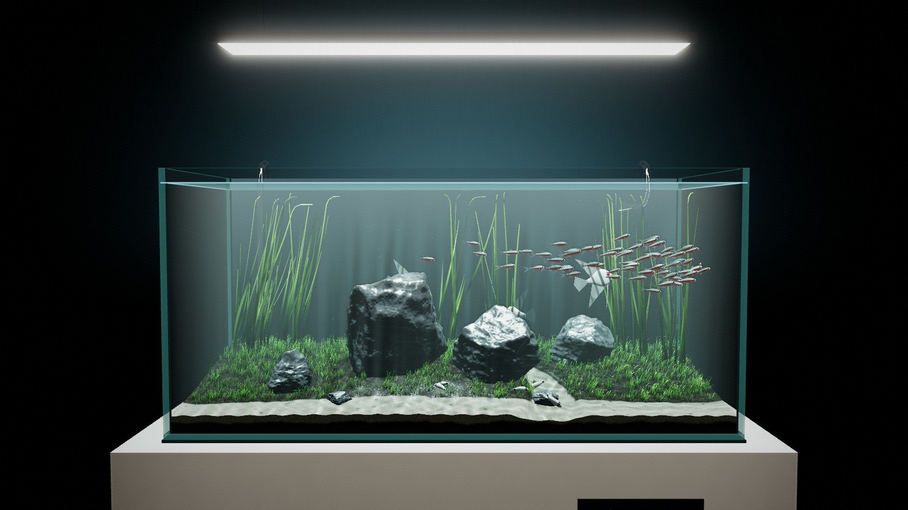

<h1 align="center"><i>Natura viva</i></h1>
<p align="center">Интерактивная 3D-инсталляция: живой аквариум, в котором всё зависит от зрителя.</p>

<p align="center">
  <a href="https://refteen.github.io/refteen/apps/aquarium/"></a>
  <a href="https://refteen.github.io/refteen/"></a>
</p>

<p align="center"></p>

## Идея

Аквариум — самый маленький из миров, за которые человек берёт на себя ответственность. Здесь всё решаете вы: свет, воздух, вода.

- **Выключите свет**, и рыбы побледнеют и уснут, как настоящие тетры.
- **Остановите фильтр**, и вода помутнеет, а рыбам станет нечем дышать.
- **Слейте воду**, и живая природа превратится в натюрморт, *nature morte*: рыбы застынут в воздухе фарфоровыми фигурами.
- **Налейте воду снова**, и цвет вернётся к каждой рыбе, как только её коснётся вода.

В работе нет ни одной текстуры и ни одной модели. Каждая рыба, каждый блик и каждый звук рождаются из кода в реальном времени.

## Что внутри

| | |
|---|---|
| **Сборка при открытии** | Тумба падает на место, стёкла слетаются, лампа спускается на тросах и загорается. Под её светом насыпается грунт, падают камни, растёт трава. Потом сверху льётся вода и оживляет рыб. |
| **Стая** | 64 кардинала живут по правилам боидов. Испуг от стука по стеклу волной расходится по стае. |
| **Вода** | Поверхность — волновое уравнение на GPU. Каустики на песке считаются из преломления света через эту поверхность, с лёгкой дисперсией. |
| **Свет** | HDR-конвейер, объёмные лучи в толще воды, bloom, поглощение и рассеяние света по длине пути в воде. |
| **Экосистема** | Мутность, водоросли на стекле, кислород, ночная окраска, пузырьки фотосинтеза на траве, мокрый после слива грунт, который постепенно высыхает. |
| **Звук** | Гул фильтра, бульканье, стук по стеклу, шум наливаемой воды и тихая эмбиент-партитура синтезируются в Web Audio. Аудиофайлов нет. |
| **Имена** | Скалярии и коридорасы носят имена Пегги Гуггенхайм и художников её круга. Нажмите на рыбу, чтобы познакомиться. |

## Управление

| Действие | Мышь / тач | Клавиша |
|---|---|---|
| Осмотреть | перетаскивание | — |
| Приблизить | колесо / щипок | — |
| Свет | кнопка «Свет» | `L` |
| Фильтр | кнопка «Фильтр» | `F` |
| Слить / налить воду | кнопка «Вода» | `W` |
| Покормить | кнопка «Корм» | `Space` / `E` |
| Звук | иконка динамика | `M` |
| Кино-режим | иконка камеры | `C` |

А ещё можно постучать по стеклу. Табличка на постаменте просит этого не делать.

## Технологии

- **Three.js** — только рендерер и математика, все материалы написаны на собственных GLSL-шейдерах;
- **WebGL 2**: float-рендер-таргеты, MSAA, instancing, alpha-to-coverage;
- **Web Audio API**: синтез, свёрточная реверберация из сгенерированного импульса;
- чистый JavaScript (ES-модули), без сборки и зависимостей в репозитории.

Производительность держат instancing, адаптивное разрешение и параллельная компиляция шейдеров.

## Запуск локально

Нужен любой статический сервер (модули не работают через `file://`):

```bash
npx serve .
```

или

```bash
python -m http.server 8080
```

three.js подгружается с CDN (jsDelivr, запасные unpkg и esm.sh).

## Структура

```
index.html        оболочка страницы
style.css         музейный интерфейс
src/main.js       состояние мира, сценарий сборки, цикл кадра
src/water.js      волновое уравнение, каустики, поверхность, струя
src/post.js       HDR, объёмный свет, bloom, тональная компрессия
src/fish.js       геометрия, шейдеры и поведение рыб
src/scape.js      грунт, камни, растения
src/tank.js       зал, постамент, стекло, лампа, фильтр
src/particles.js  пузырьки, взвесь, корм
src/audio.js      синтезированный звук
src/ui.js         интерфейс: этикетка, пульт, датчики, подписи
```

---

<p align="center"><i>Water, glass, light, code. Interactive installation, WebGL. Collection of the artist.</i><br/>© 2026 Вячеслав Погуляйченко (<a href="https://github.com/refteen">refteen</a>)</p>
